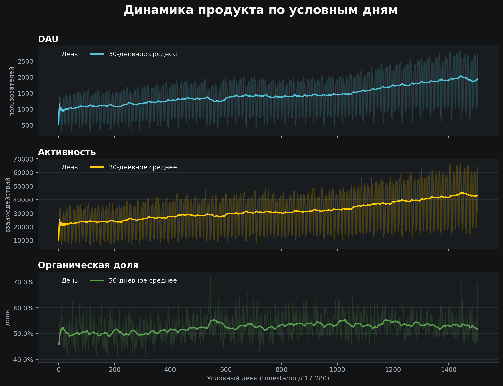
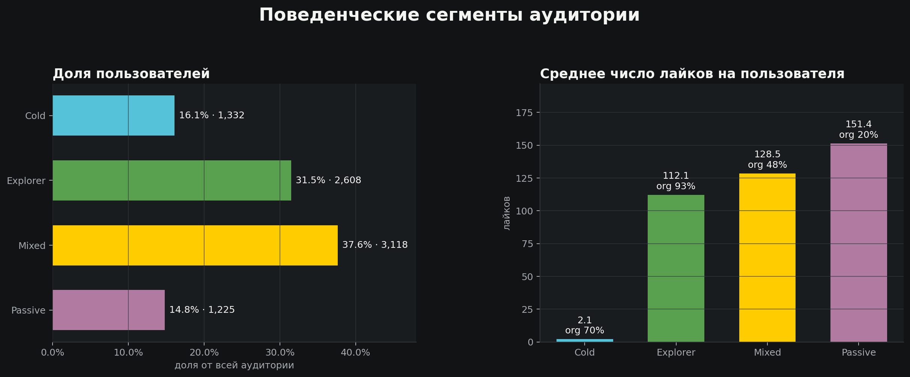
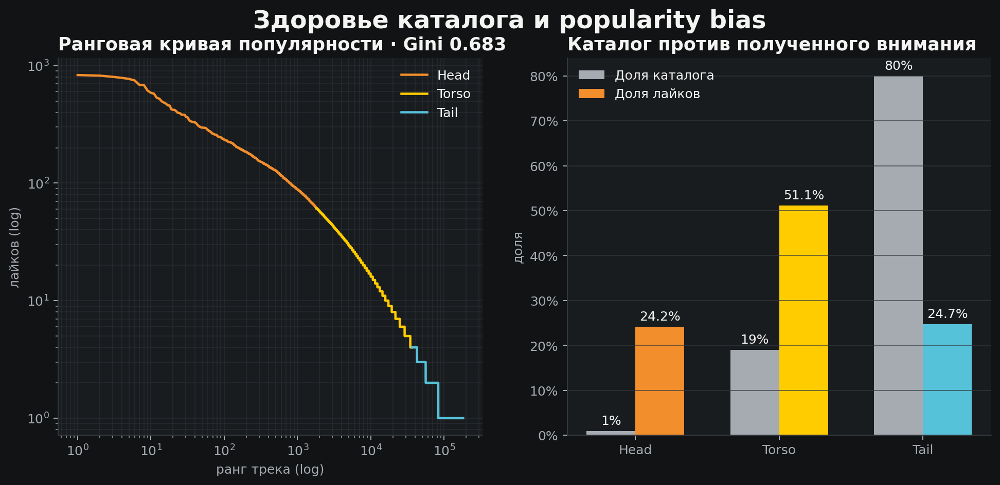

# Yambda: обзор датасета

Сводка автоматически построена из витрин в `data/marts/`.

| Метрика | Значение |
|---|---:|
| Взаимодействия | 47,790,449 |
| Лайки | 881,456 |
| Пользователи | 8,283 |
| Треки | 181,304 |
| Условные дни | 1,505 |
| Средний DAU | 1443.7 |
| Пиковый DAU | 2,858 (день 1438) |
| Organic share лайков | 56.97% |
| Gini популярности | 0.683 |

## Динамика продукта

## Сегменты аудитории

| Сегмент | Пользователи | Доля | Лайков в среднем | Organic |
|---|---:|---:|---:|---:|
| Cold | 1,332 | 16.08% | 2.1 | 69.6% |
| Explorer | 2,608 | 31.49% | 112.1 | 92.8% |
| Mixed | 3,118 | 37.64% | 128.5 | 47.8% |
| Passive | 1,225 | 14.79% | 151.4 | 20.1% |

## Состояние каталога

| Tier | Треки | Доля каталога | Лайки | Доля лайков |
|---|---:|---:|---:|---:|
| Head | 1,814 | 1.00% | 213,070 | 24.17% |
| Torso | 34,447 | 19.00% | 450,544 | 51.11% |
| Tail | 145,043 | 80.00% | 217,842 | 24.71% |

Топ-1% каталога собирает **24.2%** всех лайков, а верхние 20% —
**75.3%**. Это заметная концентрация внимания, хотя Gini 0.683
не указывает на экстремальную монополизацию каталога.
